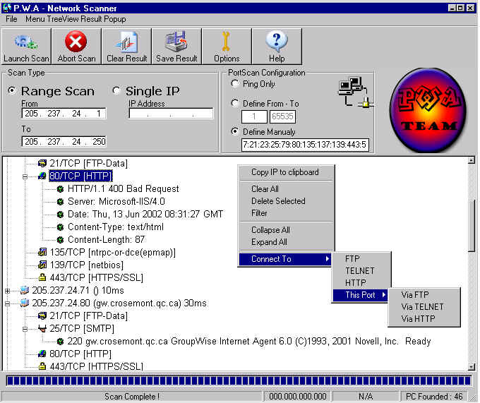



## PORT SCANNER \-=\| NetScan GUI\-Version 1\.0\.2 \|=\- PORT SCANNER

### Description

This is a real good port scanner with many option like port services retrival, range port scan, ping only, scan responsive box only, create html report AND MORE ! That use a DLL to ping host and an OCX as an IP Box, this is a realy complete appz.
 
### More Info
 
Abort scan is only working during the Ping process, and dun'T work while port scanning, i only use 1 sock connection at time that make the port scan process too slow

             |
---                |---
**Submitted On**   |2002-08-27 01:57:58
**By**             |[d1rtyw0rm](https://github.com/Planet-Source-Code/PSCIndex/blob/master/ByAuthor/d1rtyw0rm.md)
**Level**          |Advanced
**User Rating**    |4.8 (38 globes from 8 users)
**Compatibility**  |VB 5\.0, VB 6\.0
**Category**       |[Complete Applications](https://github.com/Planet-Source-Code/PSCIndex/blob/master/ByCategory/complete-applications__1-27.md)
**World**          |[Visual Basic](https://github.com/Planet-Source-Code/PSCIndex/blob/master/ByWorld/visual-basic.md)
**Archive File**   |[NetScan\_GU1229578272002\.zip](https://github.com/Planet-Source-Code/d1rtyw0rm-port-scanner-netscan-gui-version-1-0-2-port-scanner__1-38362/archive/master.zip)

